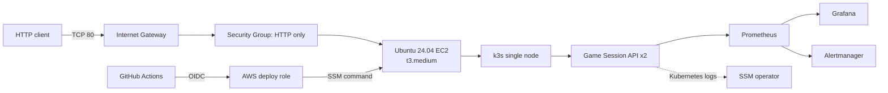

# 아키텍처

Terraform은 VPC, subnet, route, security group, Budget, IAM, EC2를 관리한다. 공개 진입점은 TCP 80뿐이며 관리와 배포는 SSM outbound channel을 사용한다. 이 구조는 단일 node 실습으로 고가용성이 아니다.

Traefik은 기본적으로 Pod IP에 직접 분산하므로 Service의 session affinity를 사용하도록 NativeLB를 활성화했다. Service는 3시간 `ClientIP` affinity를 적용한다. 이는 메모리 기반 학습 API에서 create/read/delete가 같은 replica로 가도록 하는 임시 설계다. Pod 교체에도 상태를 보존해야 하는 production 환경에서는 공유 저장소가 필요하다.

2026-09-30 라이브 검증에서 Prometheus, Grafana, Alertmanager와 API 두 replica를 4GiB node에 배치했다. Loki/Alloy는 설치 시 `MemAvailable`이 약 1.07GiB로 1.5GiB 안전 기준보다 낮아 생략했고 Kubernetes logs를 사용했다.
