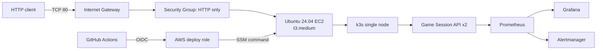

# 아키텍처

```mermaid
flowchart LR
  User[HTTP client] -->|TCP 80| IGW[Internet Gateway]
  IGW --> SG[Security Group: HTTP only]
  SG --> EC2[Ubuntu 24.04 EC2\nt3.medium]
  EC2 --> K3S[k3s single node]
  K3S --> API[Game Session API x2]
  GHA[GitHub Actions] -->|OIDC| IAM[AWS deploy role]
  IAM -->|SSM command| EC2
  API --> PROM[Prometheus]
  PROM --> GRAF[Grafana]
  PROM --> ALERT[Alertmanager]
```

Terraform은 VPC, subnet, route, security group, Budget, IAM, EC2를 관리한다. 공개 진입점은 TCP 80뿐이며 관리와 배포는 SSM outbound channel을 사용한다. 이 구조는 단일 node 실습으로 고가용성이 아니다.
