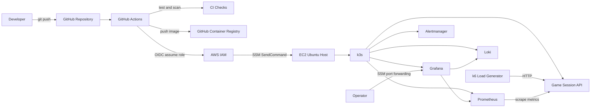

# GameOps Platform Lab Design

## 1. Purpose

GameOps Platform Lab is a one-week portfolio project for demonstrating entry-level DevOps and SRE capabilities relevant to a live game service. The project must turn the candidate's existing Linux, performance analysis, AWS EC2, and home-server experience into evidence of repeatable infrastructure provisioning, Kubernetes operation, automated delivery, observability, incident response, and technical documentation.

The application itself remains intentionally small. The primary product is the verified operating workflow and the evidence explaining why it works.

## 2. Success Criteria

The project is complete when all of the following are true:

- Terraform provisions the required AWS network, identity, compute, storage, and budget resources in `ap-northeast-2`.
- A new EC2 instance installs k3s automatically during boot.
- GitHub Actions tests the application, validates infrastructure and Kubernetes configuration, builds a container image, publishes it to GHCR, and deploys it through AWS Systems Manager.
- The deployment uses GitHub OIDC and short-lived AWS credentials rather than a stored AWS access key.
- The EC2 security group exposes only the public application port. SSH and Grafana are not publicly exposed.
- Prometheus, Grafana, and Alertmanager provide metrics, dashboards, and alerts. Loki provides centralized log search when the single node has sufficient memory; otherwise Kubernetes container logs remain the documented fallback.
- At least two incident experiments are completed; the target is all three defined in this document.
- Each completed incident includes a hypothesis, reproduction procedure, observations, response, recovery verification, and prevention action.
- A reader can reproduce provisioning, deployment, observation, rollback, incident response, and teardown by following the repository documentation.
- `terraform destroy` removes every cost-bearing resource created by the project.
- The final README links to architecture, concepts, procedures, dashboards, CI evidence, incident reports, and the actual cost report.

## 3. Scope

### 3.1 In Scope

- One AWS VPC and one public subnet in the Seoul region
- One EC2 instance running a single-node k3s cluster
- A small Python FastAPI game-session API
- Terraform infrastructure as code
- GitHub Actions CI and CD
- GHCR container image storage
- AWS Systems Manager remote execution and port forwarding
- Prometheus, Grafana, and Alertmanager, with Loki included when the single-node memory budget permits
- k6 load testing
- Deployment, rollback, alert-response, and teardown runbooks
- Three controlled incident scenarios
- Daily engineering journal and concept documentation

### 3.2 Out of Scope

- Amazon EKS
- Multi-AZ or multi-node high availability
- NAT Gateway, Application Load Balancer, RDS, Route 53, and ACM
- A production database or persistent game state
- Player authentication, matchmaking logic, billing, or real game clients
- Production-grade secret-management services
- Long-term operation after portfolio evidence has been collected

These exclusions keep the project achievable in one week and keep the focus on operational evidence rather than product functionality.

## 4. Architecture



### 4.1 Request Path

An external client sends HTTP traffic to the EC2 public IPv4 address on port 80. The k3s-provided ingress controller routes the request to the Kubernetes Service, which selects a ready game-session API Pod. The Pod processes the request and exposes application metrics at `/metrics`.

### 4.2 Deployment Path

A push to the main branch starts GitHub Actions. CI runs tests and validation, then builds an immutable image tagged with the Git commit SHA and publishes it to GHCR. GitHub exchanges its OIDC token for a short-lived AWS role. The workflow sends an SSM command to the tagged EC2 instance. The command checks out the exact Git commit, applies the Kubernetes configuration, sets the image tag to the commit SHA, waits for rollout completion, and runs a smoke test. A failed rollout invokes the documented rollback procedure.

### 4.3 Observability Path

Prometheus scrapes application, Kubernetes, and node metrics. Loki receives container logs. Grafana queries both systems. Alertmanager records alert state transitions. Grafana is accessed through an SSM port-forwarding session and has no public inbound rule.

## 5. AWS Infrastructure Design

### 5.1 Network

- Region: `ap-northeast-2`
- VPC CIDR: `10.20.0.0/16`
- Public subnet CIDR: `10.20.1.0/24`
- One Internet Gateway attached to the VPC
- One route table with `0.0.0.0/0` routed to the Internet Gateway
- Public IPv4 assignment enabled for the EC2 network interface

The public subnet avoids the cost and complexity of a NAT Gateway. This is acceptable for a short-lived learning environment because the single host must serve public HTTP traffic and pull packages and container images. The security group and SSM design limit the exposed management surface.

### 5.2 Compute

- Instance class: `t3.medium`
- Operating system: Ubuntu 24.04 LTS
- Root volume: 20 GiB gp3, encrypted
- Instance metadata: IMDSv2 required
- Resource identification: project and environment tags on every supported resource

The four GiB memory size is selected to fit k3s plus a single-replica, low-retention observability stack. Monitoring components receive explicit resource requests and limits. If memory pressure occurs, Loki is removed before reducing the core Prometheus and Grafana scope.

### 5.3 Security Group

Inbound rules:

- TCP 80 from `0.0.0.0/0` for the public demonstration API
- No inbound SSH rule
- No public Grafana, Prometheus, Alertmanager, Loki, or Kubernetes API rule

Outbound traffic is allowed so the instance can install packages, communicate with AWS Systems Manager, pull images, and resolve DNS. The reasoning and the production alternative are documented in `docs/concepts/security-group.md`.

### 5.4 IAM and Remote Administration

The EC2 instance profile grants only the permissions required for Systems Manager management. GitHub Actions uses an IAM OIDC provider and a deployment role whose trust policy is restricted to the selected GitHub repository and main branch. The deployment role can discover the tagged instance, send the approved SSM document, and read command status. It cannot create or modify general AWS infrastructure.

No long-lived AWS access key is stored in GitHub. Operators use SSM Session Manager for shell access and SSM port forwarding for Grafana.

### 5.5 Terraform State

Terraform uses local state for this short-lived single-operator project. State and all plan files are ignored by Git. The documentation explains why a shared production environment would use a remote encrypted backend with state locking. The repository includes `terraform.tfvars.example`, but the real variable file is ignored.

### 5.6 Cost Controls

- AWS Budget limit: USD 15
- Notifications: USD 5 and USD 10 actual or forecast thresholds
- No NAT Gateway, load balancer, managed database, or EKS control-plane fee
- Infrastructure exists only while experiments are running
- The operator stops EC2 during inactive periods when doing so does not interrupt evidence collection
- Teardown verification checks that no project-tagged cost-bearing resources remain

The project uses existing AWS promotional credits, which expire on 2027-01-14. The final cost report records the estimate, actual usage, credits applied, and teardown timestamp.

## 6. Application Design

### 6.1 API

The service is a Python FastAPI application with these endpoints:

- `GET /healthz`: process liveness
- `GET /readyz`: request-readiness state
- `POST /sessions`: create an in-memory synthetic game session
- `GET /sessions/{id}`: read a session
- `DELETE /sessions/{id}`: end a session
- `GET /metrics`: Prometheus metrics

The session model contains a generated identifier, region, player count, creation time, and status. State is intentionally in memory. A restart therefore removes sessions; the README states this limitation and explains that persistent state is outside this project's operational focus.

### 6.2 Fault Controls

Controlled experiments use environment variables applied through a Kubernetes ConfigMap:

- `FAULT_DELAY_MS`: adds deterministic request latency
- `FAULT_ERROR_RATE`: returns a controlled proportion of HTTP 500 responses
- `READINESS_FAIL`: forces readiness failure

There is no public endpoint for changing fault state. An operator changes the ConfigMap or Deployment through authenticated Kubernetes operations and records the command in the incident report.

### 6.3 Metrics

The service exposes:

- Request count by path, method, and status class
- Request-duration histogram
- Active in-memory session gauge
- Session creation and deletion counters
- Process and Python runtime metrics

Labels must have bounded cardinality. Session identifiers are never used as metric labels.

## 7. Kubernetes Design

The Kubernetes configuration uses Kustomize-compatible YAML and includes:

- Namespace
- Deployment
- ClusterIP Service
- Ingress
- ConfigMap
- Resource requests and limits
- Liveness, readiness, and startup probes
- PodDisruptionBudget documentation, but no PDB resource for the single-node cluster

The application initially runs with two replicas so a single Pod deletion can demonstrate self-healing with reduced service interruption. Images are pinned to the Git commit SHA. The deployment strategy uses RollingUpdate with zero unavailable Pods when resources allow.

k3s is installed from its stable release channel during implementation. The exact resolved k3s, Kubernetes, Helm chart, and tool versions are pinned in repository configuration and recorded in `docs/guides/version-matrix.md` before the first reproducible deployment.

## 8. Continuous Integration and Delivery

### 8.1 Pull Request and Push Checks

- Python formatting and static checks
- Unit and API tests
- Docker image build
- Terraform format and validation
- Kubernetes schema validation
- Container vulnerability scan
- Secret-pattern check

### 8.2 Release and Deployment

Only a successful main-branch workflow publishes and deploys an image. The image receives the immutable Git SHA tag; `latest` is not used for deployment. The deployment job:

1. Authenticates to AWS using GitHub OIDC.
2. Selects the EC2 instance by project tag.
3. Sends an SSM command containing the expected commit SHA and image tag.
4. Checks out the exact public repository commit on the instance.
5. Applies Kubernetes configuration and updates the Deployment image.
6. Waits for `kubectl rollout status`.
7. Runs health and basic session smoke tests.
8. Reports the SSM command and rollout results in the workflow log.

If rollout or smoke testing fails, the operator follows the rollback runbook. Automatic rollback is not hidden inside the workflow because the project must preserve the failed evidence and make the recovery decision visible.

## 9. Observability and Service Objectives

### 9.1 Stack

- Prometheus for metrics
- Grafana for dashboards
- Alertmanager for alert state
- Loki for logs
- Kubernetes and node exporters required by the chosen pinned chart values

All components run with one replica, short retention, and constrained resources. No observability interface is exposed publicly.

### 9.2 Experimental Objectives

- HTTP 5xx rate below 1 percent during the normal load profile
- p95 request latency below 250 ms during the normal load profile

These are laboratory targets rather than production commitments. The documentation records the workload, duration, concurrency, and sample size used to evaluate them.

### 9.3 Alerts

- Error rate above 5 percent for two minutes
- p95 latency above 250 ms for five minutes
- Application target unavailable for one minute
- Pod restart count increased during the observation window

Each experiment captures the alert's pending, firing, and resolved states where applicable.

## 10. Incident Experiments

### 10.1 Pod Termination

Delete one application Pod during a sustained normal load. Measure detection time, replacement time, readiness time, failed requests, and visible latency change. Verify that Kubernetes restores the replica count and that the service returns to its objective.

### 10.2 Invalid Image Rollout

Deploy a nonexistent image tag. Observe image-pull and rollout failures, confirm that unavailable Pods do not become ready, preserve the failed workflow and Kubernetes event evidence, execute `kubectl rollout undo`, and verify service recovery.

### 10.3 Load and Latency Degradation

Run k6 above the normal profile and apply a controlled latency or error configuration. Observe p95 latency, CPU and memory use, error rate, logs, and alert transitions. Remove the fault, reduce load, and verify alert resolution and objective recovery.

Every incident report uses this structure:

1. Hypothesis
2. Preconditions and workload
3. Reproduction steps
4. Timeline
5. Metrics, logs, events, and alerts
6. Response and recovery
7. Recovery verification
8. Root cause
9. Prevention and automation follow-up

## 11. Documentation Design

The repository documentation is part of the deliverable, not a retrospective summary. Every implementation stage records:

1. What was created
2. Why the design was selected
3. Which commands and configuration were used
4. How success or failure was verified

User-facing documentation is written primarily in Korean, while commands, file names, API fields, and standard technical terms remain in English where translation would reduce precision.

Planned structure:

```text
README.md
app/
infra/terraform/
k8s/
monitoring/
load-test/
scripts/
docs/
  architecture.md
  concepts/
    terraform.md
    vpc.md
    security-group.md
    k3s.md
    observability.md
    github-oidc.md
  decisions/
    001-single-node-k3s.md
    002-local-terraform-state.md
    003-ssm-without-ssh.md
  guides/
    prerequisites.md
    provision.md
    bootstrap-k3s.md
    deploy.md
    observe.md
    teardown.md
    version-matrix.md
  runbooks/
    deployment-failure.md
    rollback.md
    high-error-rate.md
    high-latency.md
    target-down.md
    teardown-verification.md
  incidents/
    001-pod-termination.md
    002-invalid-image.md
    003-load-degradation.md
  journal/
    day-1.md through day-7.md
  cost.md
  security.md
  evidence-index.md
```

Concept documents explain both the chosen configuration and the general concept:

- Terraform: declarative IaC, provider, resource, data source, variable, output, dependency graph, state, plan, apply, and destroy
- VPC: CIDR, subnet, route table, Internet Gateway, public IPv4, and the packet path to the API
- Security group: stateful filtering, inbound and outbound behavior, least privilege, and why SSH is absent
- k3s: its relationship to Kubernetes and the roles of control plane, node, Pod, Deployment, Service, Ingress, ConfigMap, and probes

Screenshots and pasted outputs must redact account identifiers, credentials, public IP addresses when no longer needed, and other secrets. Raw logs are trimmed to the evidence relevant to the claim.

## 12. Testing Strategy

### 12.1 Local Tests

- FastAPI unit and endpoint tests
- Metric name and label tests
- Docker build and local health check
- Terraform formatting and validation
- Kubernetes schema validation

### 12.2 Deployed Tests

- k3s node and system Pod readiness
- Application rollout status
- Public health endpoint
- Session create, read, and delete smoke flow
- Prometheus target health
- Grafana data-source health
- Loki log query when Loki is installed; otherwise timestamped Kubernetes log-query evidence
- Alert firing and resolution
- k6 thresholds under the documented normal profile

### 12.3 Teardown Tests

- `terraform destroy` exits successfully
- Terraform state contains no managed resources after destroy
- No project-tagged EC2 instance, EBS volume, public IPv4 address, or other cost-bearing resource remains
- The AWS cost report records the final verification time

## 13. Failure Handling

- Terraform failures preserve logs and state; the operator fixes the cause and reruns the idempotent operation.
- cloud-init and k3s bootstrap failures are diagnosed from cloud-init and systemd logs through SSM.
- CI failures prevent image publication and deployment.
- CD failures preserve the SSM command output and Kubernetes events.
- Readiness failure prevents a broken Pod from receiving traffic.
- Rollback is a deliberate, documented action followed by smoke and observability checks.
- Monitoring installation failure does not block application operation but does block project completion.
- Loki is the first optional component removed if the single node cannot support the full stack; Prometheus, Grafana, alerting, and Kubernetes events remain mandatory.

## 14. Seven-Day Delivery Sequence

### Day 1: Repository and Application

Create the repository structure, FastAPI service, tests, Docker image, and initial concept documentation.

### Day 2: AWS Infrastructure

Implement and validate VPC, subnet, route, security group, IAM, EC2, storage, and budget resources. Provision the first environment and record evidence.

### Day 3: k3s and Kubernetes Deployment

Verify cloud-init and k3s, add Kubernetes configuration, deploy manually, and complete the k3s concept and bootstrap guides.

### Day 4: CI and CD

Add validation workflows, GHCR publishing, GitHub OIDC, SSM deployment, rollout verification, and rollback documentation.

### Day 5: Observability

Install the constrained monitoring stack, configure dashboards and alerts, and document metrics and log flows.

### Day 6: Incidents

Run the Pod termination, invalid image, and load-degradation experiments. Complete runbooks and incident reports.

### Day 7: Portfolio Evidence and Teardown

Finish the README, diagrams, evidence index, security and cost reports, verify reproduction steps, destroy AWS resources, and prepare an evidence-based resume entry.

## 15. Portfolio Evidence

The final evidence index includes:

- Successful Terraform plan and apply output
- VPC and EC2 architecture diagram
- Passing GitHub Actions run
- Immutable GHCR image tag
- Successful SSM deployment output
- Kubernetes rollout and Pod status
- Grafana normal and incident dashboards
- Loki query result when Loki is installed; otherwise Kubernetes container-log evidence
- Alert firing and resolved states
- k6 summary
- Incident timelines and measured recovery times
- Successful Terraform destroy output
- Actual AWS cost and credit usage

Resume and interview claims must use only measurements produced by these artifacts. No production-scale, high-availability, or EKS experience is implied.
